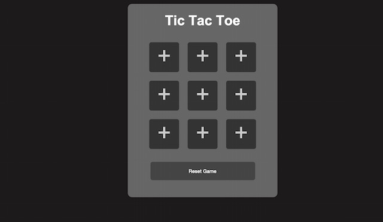

# TicTacToe
Project 10 in the stackskills javascript &amp; jQuery stack http://stackskills.com/courses/projects-in-javascript-jquery/lectures/136652

The <em>initial</em> Commit and branch on this project are simply to set up the file structure as well as boilerplate html.

The <em>HTML</em> Commit and branch add very basic html layout.

The <em>CSS</em> Commit and brnach simply style the page.  For this I am using the instructors selection, I <strong>may</strong> choose to style differently upon completion of fully functional game (black and gray are booorrriiing).

